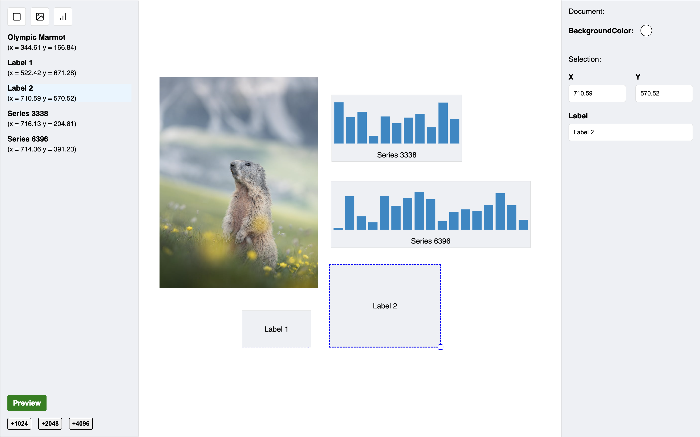

   

[Live version](https://vangelov.github.io/recoil-demo-with-jotai/)

## Scripts

In the project directory, you can run:

#### `npm run dev`

Runs the app in the development mode.\
Open [http://127.0.0.1:5173/](http://127.0.0.1:5173/) to view it in the browser.

#### `npm run build`

Builds the app for production in the `dist` folder.
